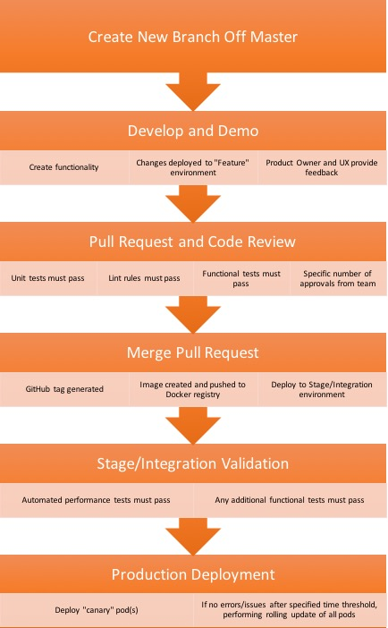

## Running The Case Study

Created from [Create React App](https://github.com/facebookincubator/create-react-app)

#### `npm install`

Installs all dependencies.

#### `npm start`

Runs the app in the development mode. 
Open [http://localhost:3000](http://localhost:3000) to view it in the browser.

The page will reload if you make edits. 
You will also see any lint errors in the console.

#### `npm test`

Launches the test runner in the interactive watch mode.

#### `npm run build`

Builds the app for production to the `build` folder. 
It correctly bundles React in production mode and optimizes the build for the best performance.

The build is minified and the filenames include the hashes. 
Your app is ready to be deployed!

## Future improvements

## CI/CD Diagram

This diagram makes the following assumptions about the environment
* App is run in a Kubernetes environment via Docker container
* Drone provides the continuous delivery platform

